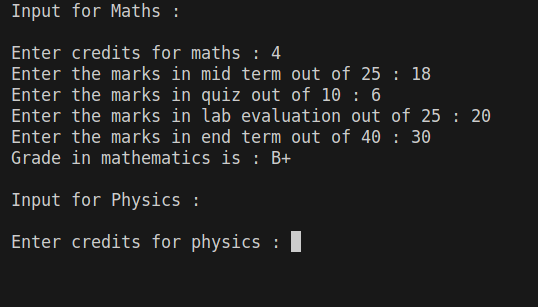

# B.Tech Semester Marks and SGPA Calculator



This Python program allows you to input marks for five subjects of your 1st-semester B.Tech program and calculate the percentage and grade for each subject. It also calculates the Semester Grade Point Average (SGPA) based on the obtained grades.

## Table of Contents

- Evaluation Components
- Grading Criteria
- How to Use
# Evaluation Components

- Mid Term Examination: 25%
- Quiz: 10%
- Lab Evaluation: 25%
- End Term Examination: 40%

# Grading Criteria

| Grade  | Marks (M) |
|--------|----------|
| A+     | M ≥ 85   |
| A      | 80 ≤ M < 85 |
| B+     | 70 ≤ M < 80 |
| B      | 60 ≤ M < 70 |
| C+     | 50 ≤ M < 60 |
| C      | 40 ≤ M < 50 |
| D      | 35 ≤ M < 40 |
| F      | M < 35   |

## How to Use

1. Clone this repository to your local machine:

   ```bash
   git clone https://github.com/arnavbansal2764/calc_sgpa.git
2. Navigate to the project directory
   ```bash
   cd semester-marks-calculator
3. Run the Python program:
   ```bash
   python marks_calculator.py
4. Input the marks for each subject when prompted.

5. The program will calculate the percentage and grade for each subject, as well as the SGPA based on the entered marks.

   

